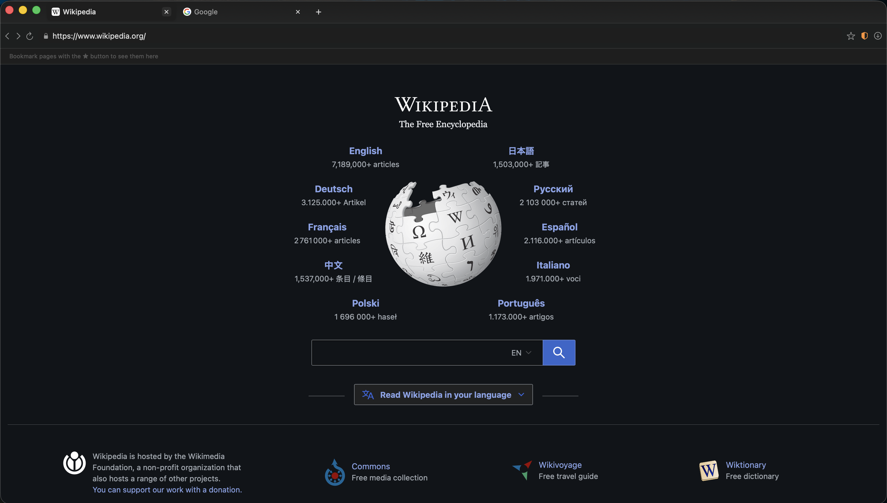
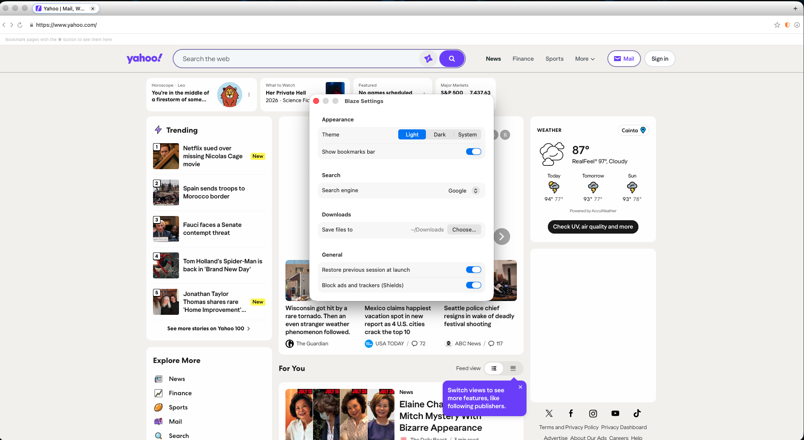

<p align="center">
  
</p>

<h1 align="center">Blaze Browser</h1>

<p align="center">
  <strong>Fast. Private. Zero bloat.</strong><br/>
  A Rust-native, ad-free macOS browser built for people who want speed without compromise.
</p>

<p align="center">
  
  
  
  
  
</p>

---

<p align="center">
  
</p>

<p align="center">
  
</p>

---

## Why Blaze?

Most browsers are Chromium wrappers — they carry Google's rendering engine, telemetry hooks, and memory overhead whether you want them or not. Blaze takes a different path:

- **No Chromium.** The core is pure Rust. The macOS shell uses Apple's WebKit as the rendering backend today, isolated behind a clean abstraction layer — and a real [Servo](https://github.com/servo/servo) v0.4.0 embedding already implements the same interface behind a feature flag, so the fully independent Rust engine can be swapped in without touching a single line of UI code.
- **No ads, ever.** A Brave-style Rust adblock engine runs natively in-process. Lists compile to a binary trie at startup — filter matching is sub-microsecond (p99 < 1 µs in benchmarks) with zero network round-trips.
- **No telemetry, period.** Zero data collection, zero crash reporting, zero analytics. What you browse stays on your device.
- **Memory efficient.** Tabs you haven't visited in a while are automatically suspended, freeing their memory. Background tabs cost almost nothing.

---

## Features

* 🔥 **Sub-microsecond ad blocking** - Rust-native filter engine, no extension overhead
* 🪶 **Lightweight** - Tab suspension frees memory automatically
* 🚫 **Zero telemetry** - No data ever leaves your device
* 🌙 **Dark & light mode** - Follows macOS system appearance instantly
* 📑 **Full tab management** - Create, close, pin, mute, reorder, move between windows
* 🔖 **Bookmarks** - Toolbar, bookmarks bar, and full manager
* ⬇️ **Downloads** - Native download engine with pause/resume/progress
* 🎬 **Video & audio** - YouTube, streaming sites, and any HTML5 media
* 🔒 **Per-site ad-block exceptions** - Allowlist individual domains with one click
* 🗂 **Session restore** - All windows and tabs come back exactly where you left them
* ♾️ **Multiple windows** - Drag tabs out to new windows, merge them back
* 🔍 **Smart address bar** - URLs, searches, and bookmarks in one field

---

## The Web Engine Abstraction

Blaze is not tied to any single rendering engine. The Rust core defines a single `WebEngine` trait:

```rust
pub trait WebEngine: Send {
    fn navigate(&mut self, url: &Url);
    fn go_back(&mut self);
    fn go_forward(&mut self);
    fn reload(&mut self);
    fn stop(&mut self);
    fn apply_blocking(&mut self, artifacts: BlockingArtifacts);
    fn set_muted(&mut self, muted: bool);
    fn suspend(&mut self);
    fn resume(&mut self, url: &Url);
    fn poll_title(&self) -> Option<String>;
}
```

Today, `WebKitBackend` implements this trait using Apple's `WKWebView` — giving full compatibility with every website while the native engine matures. Alongside it, `EmbeddedServoEngine` implements the same trait on a **real embedded Servo v0.4.0** (`blaze-engine-servo --features servo`): each tab runs Servo on a dedicated engine thread with headless rendering, native request interception wired straight into the ad-block matcher, scriptlet/cosmetic-filter injection, and popup denial. **Switching engines is a single line of configuration.** The Swift UI, the tab manager, the ad blocker, and the download engine have no knowledge of which backend is running.

```
┌────────────────────────────────────────────────────┐
│                  macOS SwiftUI Shell               │
│  TabStrip · Toolbar · Bookmarks · Settings         │
└──────────────────────┬─────────────────────────────┘
                       │  FFI (uniffi / Swift)
┌──────────────────────▼─────────────────────────────┐
│              blaze-core  (Rust)                    │
│  Tab manager · Session · Downloads · Events        │
└──────────┬───────────────────────┬─────────────────┘
           │                       │
┌──────────▼──────────┐  ┌────────-▼──────────────────┐
│  WebKitBackend      │  │  EmbeddedServoEngine       │
│  WKWebView via FFI  │  │  Servo v0.4.0, pure Rust   │
└─────────────────────┘  └───────────────────────────-┘
           │
┌──────────▼──────────────────────────────────────────┐
│  blaze-adblock  (Rust)                              │
│  Brave-compatible filter engine · < 1 µs p99        │
└─────────────────────────────────────────────────────┘
```

---

## Architecture at a Glance

```
blaze-browser/
├── crates/
│   ├── blaze-core        # Tab, window, session, downloads, bookmarks
│   ├── blaze-engine      # WebEngine trait + shared types
│   ├── blaze-engine-servo# Servo v0.4.0 embedding (--features servo) + simulated engine for parity tests
│   ├── blaze-adblock     # Brave-style filter engine
│   ├── blaze-net         # HTTP, range requests, download worker
│   ├── blaze-storage     # SQLite profile: history, bookmarks, settings
│   ├── blaze-media       # Audio/video state tracking
│   └── blaze-ffi         # uniffi bindings for Swift
├── platforms/
│   └── macos/            # SwiftUI shell + XcodeGen project
├── fuzz/                 # cargo-fuzz harnesses
└── scripts/
    └── build-dmg.sh      # Universal (arm64 + x86_64) DMG builder
```

---

## Performance

| Metric | Result | Gate |
|--------|--------|------|
| Ad filter match (p99) | **917 ns** | < 100 µs |
| Filter engine cache load | **3.5 ms** | — |
| Cold browser start | **< 500 ms** | — |
| 10-page RSS growth | **< 64 MiB** | — |

Benchmarks run with `BLAZE_PERF_GATE=1 cargo bench -p blaze-adblock`.

---

## Install

1. Download the latest `Blaze-x.x.x.dmg` from [Releases](https://github.com/mikekpl/blaze-browser/releases).
2. Open the DMG, drag **Blaze.app** to Applications.
3. **Right-click → Open** on first launch (unsigned build — Gatekeeper will ask once).
4. If the Dock icon looks stale after update, run `killall Dock`.

> Blaze is currently **macOS 13+ only** (Apple Silicon and Intel, universal binary). Linux, Windows, Android, and iOS platform stubs are in the architecture but not yet wired up.

---

## Contributing

Pull requests are welcome. The toolchain is pinned to Rust 1.95.0 (the version Servo v0.4.0 is built with) via `rust-toolchain.toml` — rustup picks it up automatically. Please run `cargo clippy --workspace --all-targets -- -D warnings` and `cargo test --workspace` before opening a PR. The CI pipeline also runs AddressSanitizer, ThreadSanitizer, and fuzz smoke tests on every push.

---

## License

MIT — see [LICENSE](LICENSE).